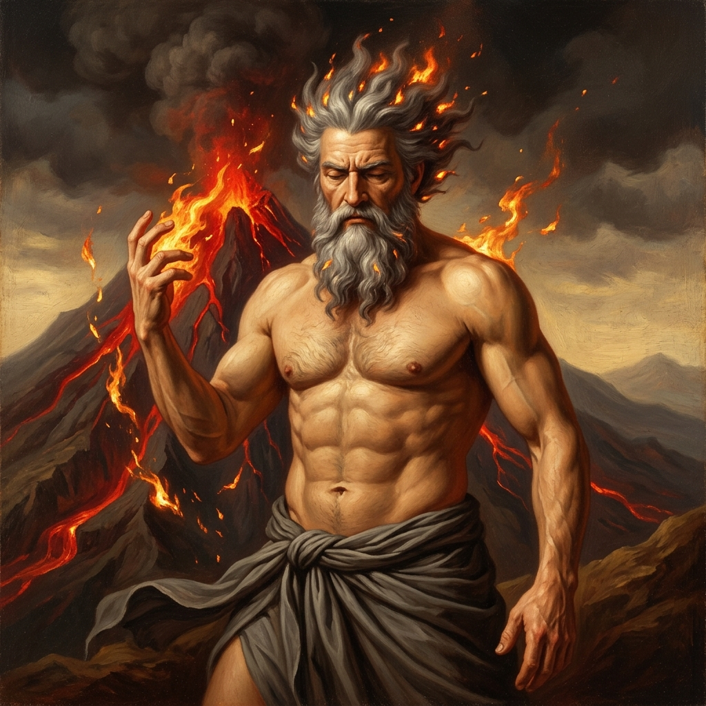
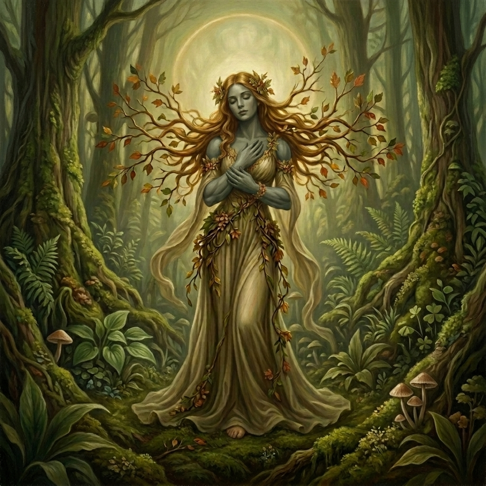

# Lore i Historia (Lavandia)

Mitologia świata opiera się na pierwotnych siłach czterech żywiołów oraz ich boskich uosobieniach.

---

## 🌌 Kosmologia i Wybuch Żywiołów
Wszechświat Lavandii narodził się w momencie gwałtownego zespolenia czterech wolno dryfujących cząstek czystej energii: Ognia, Wody, Ziemi i Wiatru. Wcześniej balansowały się one w idealnej pustce (stanie zerowym), lecz ich ostateczna kolizja wywołała kosmiczną eksplozję, dając początek czasowi, przestrzeni oraz czterem boskim istotom uosabiającym te żywioły.

Przez stulecia bogowie żyli w harmonii, co pozwoliło na rozwój czterech wielkich ras. Spokój został jednak zburzony, gdy bogowie zaczęli bezpośrednio ingerować w losy śmiertelników.

---

## ⏳ Wielka Wojna i Rytuał Letargu (Uśpienie Bogów)

Eskalacja konfliktu między bogami (Pyrakos, Gaya, Nerea, Anemos) doprowadziła świat na skraj całkowitej zagłady. Kataklizmy wywołane ich starciami zagrażały przetrwaniu wszystkich ras. W obliczu ostatecznego unicestwienia doszło do bezprecedensowego wydarzenia w historii świata:

* **Przymierze Ponad Podziałami**: Najpotężniejsi magowie i mędrcy ze wszystkich czterech ras (Ludzi, Korganów, Aerytów i Nereidów) zjednoczyli się, tworząc legendarną **Radę Żywiołów** (lub *Konklawe Przebudzonych*).
* **Rytuał Odesłania**: Magowie ci uznali, że dopóki bogowie stąpają po świecie, wojna nigdy się nie skończy. Wykorzystując połączone moce wszystkich czterech żywiołów, odprawili potężny rytuał, który uwięził bóstwa i pogrążył je w głębokim, mistycznym letargu (śnie).
* **Konsekwencje**: Bogowie zostali odesłani poza granice fizycznego świata, a ich bezpośrednia obecność ustała. Rasy podpisały kruchy rozejm, a magia żywiołów zaczęła być czerpana jedynie z rezydualnej energii uśpionych bogów, a nie ich bezpośredniej interwencji. 
* **Współczesność**: Pamięć o rytuale uleciała w zapomnienie lub stała się legendą. Istnieją jednak obawy, że imperialne ambicje ludzi lub desperacja uciemiężonych Korganów mogą doprowadzić do prób przebudzenia któregoś z bóstw, co na nowo rozpętałoby katastrofalną wojnę.

---

## 🛐 Boski Panteon i Powiązane Rasy

### 🔥 Bóg Ognia: Pyrakos (Dawca Iskry)
*Stworzyciel rasy Ludzi. Reprezentuje ambicję, ekspansję, ciepło, ale i destrukcję.*
- **Mitologia**: Złamał pakt o nieingerencji i podarował ludziom "Iskrę" (ogień). Ludzie nauczyli się go kontrolować, co szybko doprowadziło do ich dominacji technologicznej i militarnej nad innymi rasami.
- **Relacje**: W stałym, "gorącym" sojuszu z Boginią Ziemi, Gayą.
- **Wygląd (Kanon Wizualny)**: Pyrakos ma wygląd potężnego, starszego ludzkiego mężczyzny z długą, gęstą, szarą brodą oraz zmierzwionymi, szarymi włosami, z których wystrzeliwują płomienie i iskry. Posiada zamknięte oczy (stan letargu) i surowy, gniewny, dynamiczny wyraz twarzy. Charakteryzuje się dojrzałym, wysportowanym, lekko owłosionym torsem. Stoi w dynamicznej, agresywnej pozie, z jedną dłonią uniesioną w geście kontrolowania płomieni. Jest odziany jedynie w proste, szare zwoje tkaniny owinięte wokół pasa. W tle wznosi się potężny, gwałtownie wybuchający wulkan, a na niebie widać chmury dymu i popiołu. Całość jest przedstawiona w bezramkowym, malarskim stylu, emanując surową, niszczycielską siłą ognia.

### 🪨 Bogini Ziemi: Gaya (Strażniczka Tamy)
*Stworzycielka rasy Korganów. Reprezentuje stałość, siłę fizyczną, wzrost i obronę.*

- **Mitologia**: Widząc spustoszenie i powodzie wywołane przez Boginię Wody, Nereę, stworzyła gigantyczną, szybkorosnącą roślinność oraz wielkie grzyby, w których osiedlili się Korganie. Pomogła im wybudować tamy chroniące przed potopem.
- **Relacje**: Sprzymierzona z Bogiem Ognia, Pyrakosem.
- **Wygląd (Kanon Wizualny)**: Gaya ma wygląd potężnej, lecz pełnej gracji Korganianki o jednolitym, szaro-oliwkowym odcieniu skóry (na całym ciele, wliczając dłonie i bose stopy). Jej rysy twarzy są dystyngowane, ale silne i zdecydowane (mocno zarysowana linia żuchwy i kości policzkowych). Oczy ma zamknięte (stan letargu/snu), a wyraz twarzy jest spokojny i majestatyczny. Jej włosy to spektakularne, rozłożyste złoto-brązowe gałęzie drzew i jesienne liście tworzące naturalną, organiczną aureolę wokół jej głowy, ozdobioną wiankiem z leśnych kwiatów. Nosi długą, powłóczystą suknię w kolorze zgniłej zieleni i złota, utkaną z pnączy, bluszczu i leśnych liści, odsłaniającą jej bose stopy. Ma wysportowaną, atletyczną, lekko umięśnioną sylwetkę.

### 💧 Bogini Wody: Nerea (Pani Fal)
*Stworzycielka rasy Nereidów. Reprezentuje płynność, uzdrawianie, głębiny, ale i niszczycielskie tsunami.*
- **Mitologia**: Zareagowała na brutalność ludzi wobec innych ras (np. smażenie Nereidów nad ogniem). Nauczyła Nereidów władania wodą, by zatapiać ludzkie osady przybrzeżne.
- **Relacje**: Połączona domniemanym, mistycznym romansem z Bakiem Wiatru, Anemosem (sojusz żywiołów neutralnych).

### 💨 Bóg Wiatru: Anemos (Władca Wichrów)
*Stworzyciel rasy Aerytów. Reprezentuje wolność, zmianę, zwinność i intelekt.*
- **Mitologia**: Nie mógł bezczynnie patrzeć na tamy wzniesione przez Korganów. Nauczył Aerytów kontrolowania powietrza, by za pomocą potężnych tornad niszczyć umocnienia Korganów.
- **Relacje**: Związany z Boginią Wody, Nereą, sojuszem i miłością.

---

## 👥 Rasy Świata Lavandii
Mieszkańcy świata są humanoidalni, ale posiadają unikalne cechy fizyczne powiązane z ich żywiołowym pochodzeniem.

### 1. Ludzie (Ogień)
- **Charakterystyka kulturowa**: Ambitni, zorganizowani i dominujący militarnie. Otrzymanie "Iskry" od Pyrakosa zapoczątkowało ich gwałtowny rozwój, ale z czasem przyniosło zepsucie. Posiadanie ognia zrodziło w nich ogromną pazerność, butę oraz przekonanie o własnej wyższości nad innymi rasami.
- **Imperializm**: Ludzkie imperium stale dąży do ekspansji terytorialnej i podboju innych krain w celu zdobywania surowców. Inne rasy traktują instrumentalnie, jako siłę roboczą lub poddanych gorszej kategorii.
- **Kult Czystej Krwi**: W społeczeństwie ludzi panuje obsesja na punkcie czystości krwi. Czystej krwi człowiek stoi na szczycie hierarchii. Wszelkie mieszanki rasowe (Mieszańcy) są traktowane z pogardą, spychane na margines społeczny i pozbawione praw. Prawo jest dla nich bezwzględne.

### 2. Korganie (Ziemia)
- **Wygląd fizyczny**: Potężnie zbudowani, niezwykle wysocy i umięśnieni humanoidy (mocno inspirowani Nordeinami). Posiadają szaro-brązową, twardą skórę, często krótkie, jasne/srebrzyste włosy oraz surowe, groźne rysy twarzy. Ich sylwetka emanuje surową siłą fizyczną.
- **Duchowość i wierzenia**: W przeciwieństwie do pragmatycznych ludzi, Korganie głęboko i szczerze czczą boginię ziemi, Gayę. Wierzą w reinkarnację i wieczny cykl natury – wierzą, że po śmierci odrodzą się jako zwierzę, roślina lub inny element puszczy. Z powodu tej duchowości i wiary w jedność z naturą są często wyszydzani przez ludzi.
- **Kowalstwo i rzemiosło**: Mając naturalny dostęp do najgłębszych bogactw ziemi – rzadkich, niezwykle wytrzymałych super-minerałów i rud metali – Korganie stali się legendarnymi kowalami. Umiejętność tę rozwinęli dzięki dawnemu sojuszowi z ludźmi, od których nauczyli się kontrolować ogień Pyrakosa do celów metalurgicznych.
- **Sytuacja społeczna**: Mimo dawnego sojuszu i handlu bronią, ludzie zawsze traktowali Korganów z góry jako istot "bardziej prymitywnych". Ostatecznie doprowadziło to do zdrady przymierza i najazdu ludzi na ich tereny w celu eksploatacji złóż i lasów.
- **Styl Walki**: Korganie dzielą się na dwa obozy bojowe:
  1. *Szkoła Stali i Siły*: Wojownicy stawiający na siłę fizyczną, w ciężkich zbrojach płytowych, posługujący się toporami i młotami bojowymi.
  2. *Szkoła Magii Ziemi*: Szamani manipulujący gruntem, skałami i roślinnością, potrafiący czasowo utwardzać swoje ciała do twardości granitu.

### 3. Aeryci (Wiatr)
- **Wygląd fizyczny**: Smukli, wysocy o lekko wychudzonej, lecz wysportowanej sylwetce. Ich skóra ma popielato-szary, marmurkowy odcień z delikatnymi, ciemniejszymi wzorami. Charakteryzują się mocno wydłużonymi, elfickimi uszami, wysokimi kośćmi policzkowymi oraz dumnym, dystyngowanym spojrzeniem. Ich oczy mają głęboki, bordowo-czerwony odcień, co nadaje im egzotyczny i mistyczny wygląd.
- **Fizjologia i poruszanie się**: Dzięki specyficznej budowie ciała (bardzo lekki kościec) oraz wrodzonej magii wiatru potrafią wykonywać niebywałe skoki, łagodnie opadać z olbrzymich wysokości oraz szybować na wietrze (np. przy użyciu specjalnych, lekkich peleryn lub skrzydeł szybowcowych).
- **Kultura i zachowanie**: Ucieleśnienie dystyngowania i elegancji. Aeryci wysławiają się w sposób niezwykle poetycki i wyszukany, używając bogatego słownictwa. Są dumni, powściągliwi i chłodni w obyciu. Wpisują się w klasyczny stereotyp dystyngowanych, wyniosłych elfów.
- **Technologia i styl życia**: Są wysoce zaawansowani technologicznie. Ich górskie wieże i osady pełne są skomplikowanych mechanizmów napędzanych wiatrem (np. podniebne statki żaglowe, windy mechaniczne, zaawansowane przyrządy astronomiczne i optyczne).
- **Mentalność**: Uważają się za najbardziej rozwiniętą intelektualnie i kulturowo rasę świata. Ta wysoka samoocena sprawia, że patrzą z góry na swoich sojuszników, Nereidów, traktując ich protekcjonalnie i z dystansem.

### 4. Nereidzi (Woda)
- **Pochodzenie i ewolucja**: Pierwotnie żyli wyłącznie pod wodą, gdzie budowali osady z żywych raf koralowych i głębinowych skał. Gdy Pyrakos dał ludziom ogień, zaburzając równowagę, bogini wody, Nerea, przyspieszyła ewolucję swojej rasy. Dała im możliwość wyjścia na ląd, wykształcając u nich płuca (obok skrzeli) i dostosowując ich ciała do poruszania się w świecie nadwodnym.
- **Fizjologia**: Pół-wodna rasa. Choć potrafią swobodnie i bez ograniczeń czasowych przebywać na lądzie, wciąż najlepiej i najbardziej naturalnie czują się w środowisku wodnym (gdzie ich zwinność i prędkość są niezrównane). Mają drapieżne, syrenie cechy, lekko łuskowatą skórę i błony pławne.
- **Stosunki społeczne**: W sojuszu z Aerytami są traktowani jako ta "gorsza", bardziej prymitywna strona. Aeryci patrzą na nich z góry, podobnie jak Ludzie na Korganów. Tworzy to silne napięcia wewnątrz koalicji Wiatru i Wody.

---

## 🔮 Magia Żywiołów i Predyspozycje Rasowe

W uniwersum Lavandii energia żywiołów przepływa przez wszystkie żywe istoty. W teorii każdy przedstawiciel dowolnej rasy może nauczyć się posługiwać każdym z czterech żywiołów, jednak w praktyce istnieją surowe ograniczenia:

### Czystsza Krew (Czystej Krwi Rasy)
Przedstawiciele czystej krwi mają silną, naturalną predyspozycję do swojego macierzystego żywiołu:
- **Ludzie** $\rightarrow$ Ogień.
- **Korganie** $\rightarrow$ Ziemia.
- **Aeryci** $\rightarrow$ Wiatr.
- **Nereidzi** $\rightarrow$ Woda.

Rzucanie czarów innych żywiołów wymaga od czystej krwi ras tytanicznego wysiłku i lat treningów, a efekty i tak są o wiele słabsze.

### Mieszańcy (Hybrydy)
Dzieci z mieszanych związków (np. pół-człowiek, pół-korgan) są rzadkością i często spotykają się z ostracyzmem społecznym. Mają jednak unikalny dar – ich krew łączy energie różnych żywiołów. 
- **Zdolności**: Mieszańcy mają znacznie większe predyspozycje do nauki i płynnego przełączania się między różnymi żywiołami. Stanowi to doskonałe podłoże fabularne dla głównego bohatera gry, wyjaśniające jego unikalny dar dynamicznego władania żywiołami w walce.
